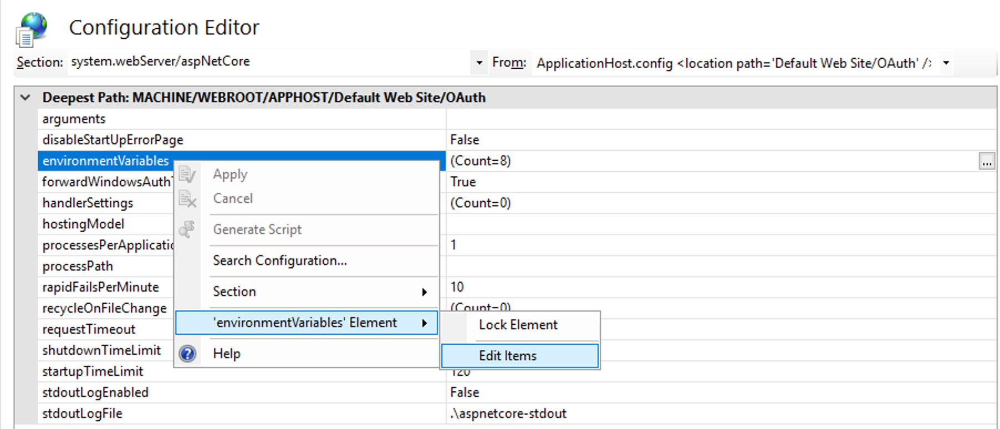
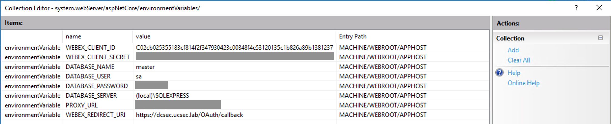

# Webex Device Provisioning using Powershell and IIS

This is an example of a semi-automated Cisco video device provisioning. It was inspired by a discussion with a customer who wanted to deploy video devices remotely with minimal requirements on local staff. The staff is responsible for physical mounting and connecting the device to the network and display. Mounting in small rooms is not difficult and no special qualification should be needed. For mounting the devices in large or special purpose rooms, a trained staff is recommended. Setup and registration to Webex is performed remotely using this application. The application user needs to know only two parameters:

- **IP address** of the device - can be fetched from a DHCP server or read by the local staff from the screen or touch panel
- **room name and location** - should be provided by the local staff

The application performs following steps:

1. **pre-deployment configuration** - set http proxy, time and date parameters and language
2. **deployment** - create or select Webex workspace, generate activation code, deploy the code
3. **post-deployment configuration** - create a local user on the video device

The application is written in Powershell, the main script is [ps/registerDevice.ps1](ps/registerDevice.ps1). In order to use [Webex API](https://developer.webex.com/docs/getting-started), the application needs a valid Access Token. The token is stored in an SQL database.

Because the script is expected to run unattended, the Access Token generation needs to be based on OAuth code grant flow. The grant flow provides Refresh Token which can be used to automatically re-create the Access Token once it expires. OAuth requires an [Integration](https://developer.webex.com/docs/integrations) on Webex side. The integration needs to have following scopes enabled:

spark-admin:workspaces_write  
spark-admin:locations_write  
spark-admin:devices_read  
spark-admin:locations_read  
spark-admin:people_write  
spark-admin:workspace_locations_write  
spark-admin:workspace_locations_read  
spark-admin:workspaces_read  
spark-admin:devices_write  
spark-admin:people_read  
identity:placeonetimepassword_create  
spark:xapi_statuses  
spark:xapi_commands

The OAuth process is implemented in C# and prepared to run on MS Internet Information Server (IIS).

## Application Workflow

The workflow is marked in comments in [ps/registerDevice.ps1](ps/registerDevice.ps1). The initial part of the script includes the necessary parameters:

**deviceIP** - IP address of the video device  
**workspaceName** - Webex Workspace to which the device should be registered

Then there are parameters which can stay the same for all devices or can be configured based on the device location:

**timeZone** - time zone of the device  
**timeFormat** - format of the time  
**dateFormat** - format of the date  
**language** - language of the device's user interface

The parameter values can be found at [RoomOS Time](https://roomos.cisco.com/xapi/domain/?domain=Time&Type=Configuration) and [RoomOS UserInterface](https://roomos.cisco.com/xapi/domain/?domain=UserInterface&Type=Configuration).

Additional parameters are:

**proxyConfig** - proxy configuration - see [RoomOS NetworkServices](https://roomos.cisco.com/xapi/domain/?domain=NetworkServices&Type=Configuration)
**closeInitialWizard** - $true or $false - set to $false if the device is being deployed for MTR mode, so the mode can be selected on the device's touch panel
**localUser** - local user account that gets created on the device after deployment - see [RoomOS UserManagement](https://roomos.cisco.com/xapi/domain/?domain=UserManagement&Type=Command)

Application configuration is set using environment variables. See [ps/setEnvironment.sample.ps1](ps/setEnvironment.sample.ps1) for the list and modify them accordingly. Same approach applies to the IIS part of the application. The IIS environment variables are:

**DATABASE_SERVER** - SQL database server, for example **(local)/SQLEXPRESS**  
**DATABASE_NAME** - SQL database name, for example **master**  
**DATABASE_USER** - SQL database user, for example **sa**  
**DATABASE_PASSWORD** - SQL database password  
**WEBEX_CLIENT_ID** - client id provided in Webex Integration  
**WEBEX_CLIENT_SECRET** - client secret provided in Webex Integration  
**WEBEX_REDIRECT_URI** - redirect URI - URL of the IIS server for the **callback** endpoint of the application, for example **https://server.domain.com/OAuth/callback**  
**PROXY_URL** - proxy URL

### STEP 1

Check connection to the device. Set the http proxy, language, time zone, date and time formats.

### STEP 2

Search for the existing Webex Workspace and create new if it doesn't exist.

### STEP 3

Optionally close the initial wizard.

### STEP 4

Create activation code for the Workspace.

### STEP 5

Register the device using the activation code.

### STEP 6

Wait for the device to become registered to Webex.

### STEP 7

Create local user on the device. Set the language again to make sure the device localization is correct.

### STEP 8

Verify the access to the device using the newly created local user.

## Deploy the application

Create **WebexTokens** table in the SQL database using the [sql/createWebexTokens.sql](sql/createWebexTokens.sql) script. The table will store the Access Token and Refresh Token.

The application was written using Visual Studio. Visual Studio provides tools to deploy the application to IIS. Install .NET 10.0 hosting bundle to the IIS from
[https://dotnet.microsoft.com/permalink/dotnetcore-current-windows-runtime-bundle-installer](https://dotnet.microsoft.com/permalink/dotnetcore-current-windows-runtime-bundle-installer).  
After the deployment, set the environment variables in IIS. See for example [here](https://stackoverflow.com/questions/31049152/publish-to-iis-setting-environment-variable).




The Powershell script requires SqlServer module, install it using:

```powershell
Install-Module -Name SqlServer -Force -AllowClobber
```

Before running the [ps/registerDevice.ps1](ps/registerDevice.ps1) make sure the environment variables are available to it. For example by copying [ps/setEnvironment.sample.ps1](ps/setEnvironment.sample.ps1) to **setEnvironment.ps1**, modifying it accordingly and running it before the **registerDevice.ps1** script.
